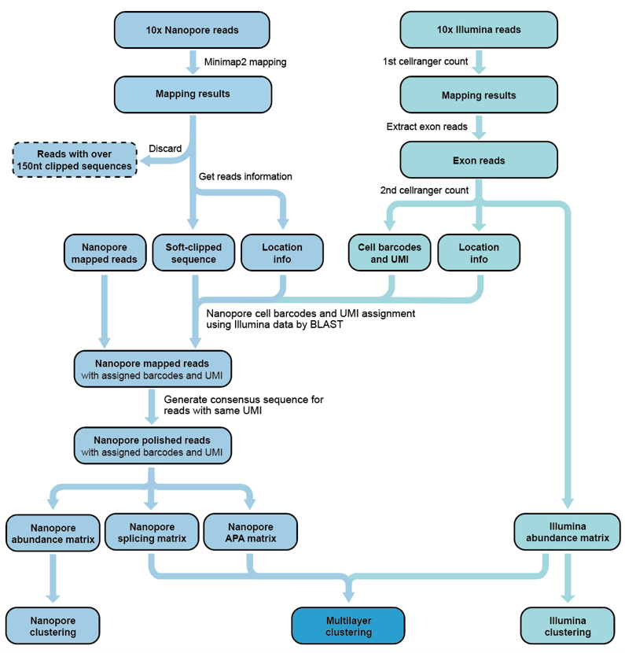
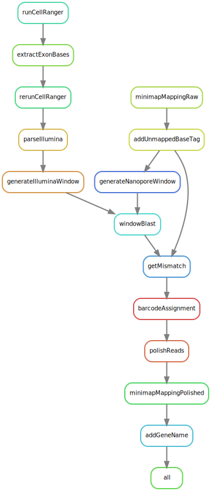

# snuupy

single-nucleus utility in python

# tutorial

Git clone or download this repository then modify the paths in the configuration file before running snakemake. 

# usage

snuupy.py [OPTIONS] COMMAND [ARGS]...

Options:

  --help  Show this message and exit.

Commands:

  addGeneName                     parse polished reads mapping results...
  
  addPolyATag                     add polyA length tag for bam files
  
  addUnmappedBaseTag              get unmapped base tag
  
  barcodeAssignment               assign barcode for each Nanopore...
  
  calculateMultilayerConnectivitiesMat   In short, we first separately...
                                  
  generateH5adFromKb              get adata from kbpython result...
  
  generateIlluminaWindow          output illumina reads based on...
  
  generateIlluminaWindowFromKb    generate illumina windows from...
  
  generateMtx                     generate matrices
  
  generateNanoporeWindow          output nanopore reads based on...
  
  getMismatch                     calculate mismatch based on blast...
  
  getSpliceInfo                   get splice information which used...
  
  parseIllumina                   parse Illumina bam file and...
  
  polishReads                     polish barcode assigned Nanopore...
  
  polyAClusterDetected            detect PolyA Cluster
  
  windowBlast                     blast find potential UMI/Bc

# packages required
- python3 
  - pandas 
  - scipy 
  - numpy 
  - scanpy 
  - joblib 
  - loguru 
  - portaion 
  - ont-fast5-api 
  - more_itertools
  - biopython
  - pyfastx
- Snakemake 
- minimap2 
- poaV2 
- seqkit 
- racon 
- picard 

# acknowledge
This pipeline was inspired by Sicelore

# open source license
The source code is released under MIT license. 
